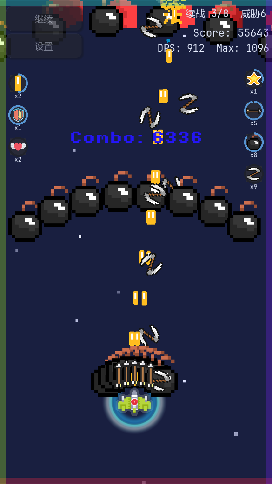
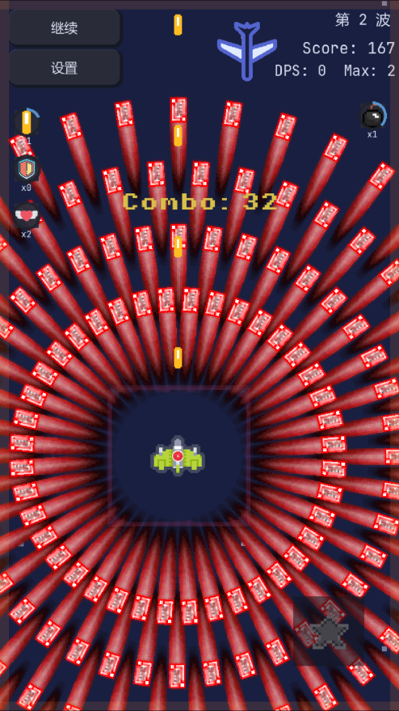
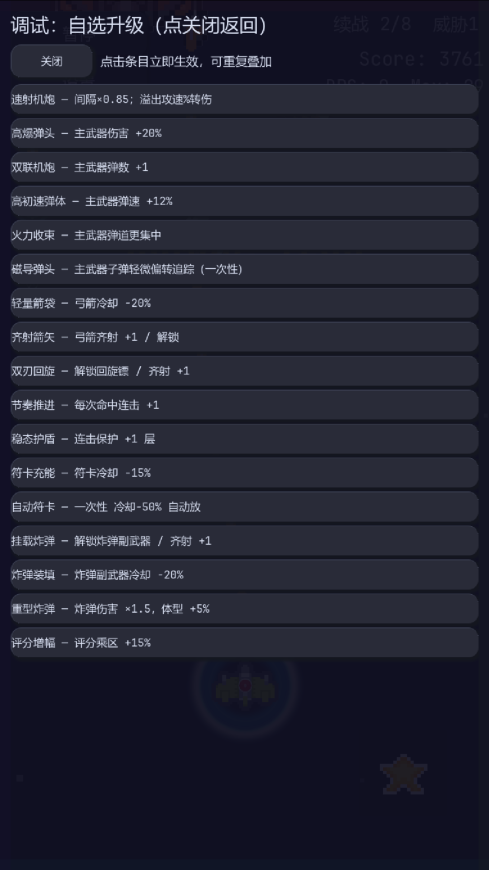

# Plane War

> 一款基于 Godot 4 的竖屏弹幕射击游戏：清场波次、三选一成长、挑战 Boss，冲击更高分数与连击。

<p align="left">
  
  
  
</p>

## 游戏预览

<p align="center">
  
  &nbsp;&nbsp;
  
  &nbsp;&nbsp;
  
  &nbsp;&nbsp;
  
</p>

| 主菜单 | 战斗中 | 升级三选一 | 挑战 Boss |
|---|---|---|---|

## 功能亮点

- 🎮 **核心循环**：波次战斗 -> 清场结算 -> 三选一强化 -> Boss 挑战  
- ⚡ **操作手感**：单手拖拽移动 + 自动射击，适配移动端节奏  
- ❤️ **生命机制**：2 条命离散生命系统，受击扣命并短暂无敌，波次间可恢复  
- 🧠 **成长策略**：Roguelite 升级池构筑，围绕生存、爆发、节奏做取舍  
- 📊 **局外反馈**：本地记录历史最高得分、连击和 DPS  

## 快速开始

### 1) 运行项目（Godot 编辑器）

1. 安装 [Godot 4.6](https://godotengine.org/)  
2. 用 Godot 打开仓库根目录  
3. 运行主场景 `scenes/MainMenu.tscn`

### 2) 导出目标平台

- 导出预设见 `export_presets.cfg`  
- 当前面向平台：`Windows`、`Android`（并保留 `Web` 相关导出配置）

如果你要开发 Mod，建议先阅读运行机制文档，再基于示例 Mod 快速验证事件与注册流程。

## 文档导航

- 📘 总体 GDD：[`docs/gdd/GDD.md`](docs/gdd/GDD.md)  
- 🧱 分章节设计：[`docs/gdd/sections/`](docs/gdd/sections/)  
- 🖼 截图资源：[`docs/picture/`](docs/picture/)  
- 🗒 更新记录：[`CHANGELOG.md`](CHANGELOG.md)

## 项目结构（简版）

```text
plane-war/
├─ scenes/           # 场景
├─ scripts/          # 游戏逻辑脚本
├─ assets/           # 资源素材
├─ docs/             # 文档（GDD、Mod 指南、截图等）
└─ project.godot
```

## 开发与协作

- 仓库地址：[github.com/qingzhixing/plane-war](https://github.com/qingzhixing/plane-war)  
- 欢迎通过 Issue / PR 提出建议与改进  
- 维护者：`qingzhixing`

## 许可说明

若仓库根目录未单独放置 `LICENSE`，请以仓库内实际声明为准；引用或分发前请确认授权范围。
